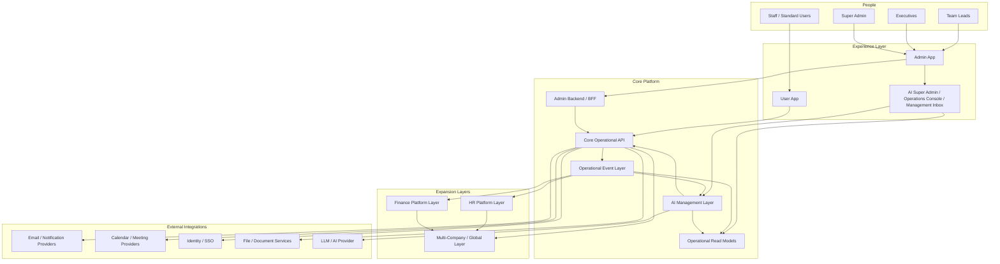
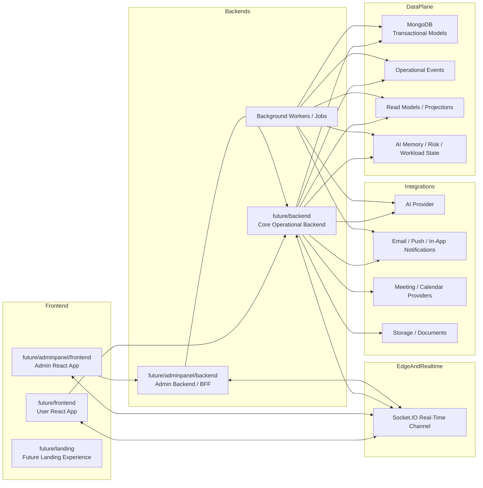
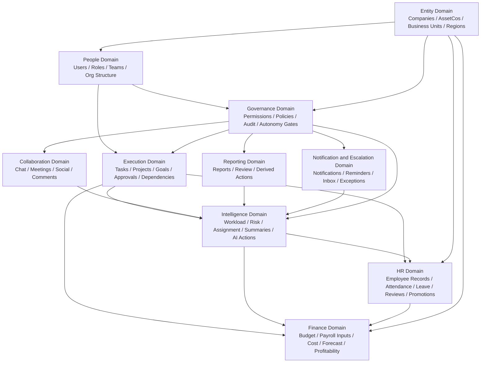
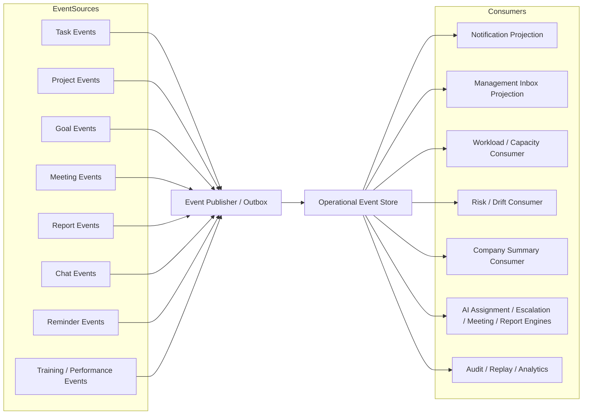
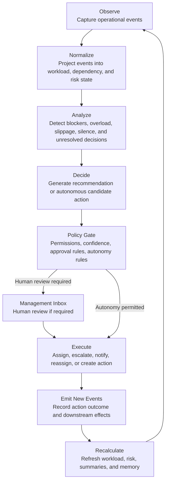
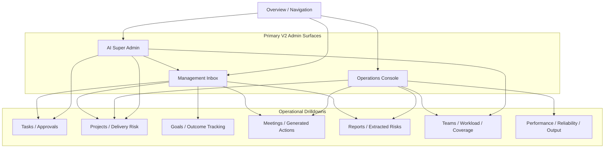
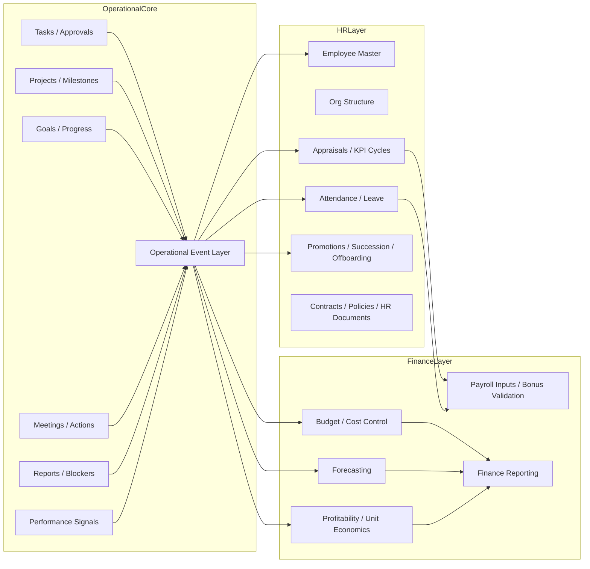
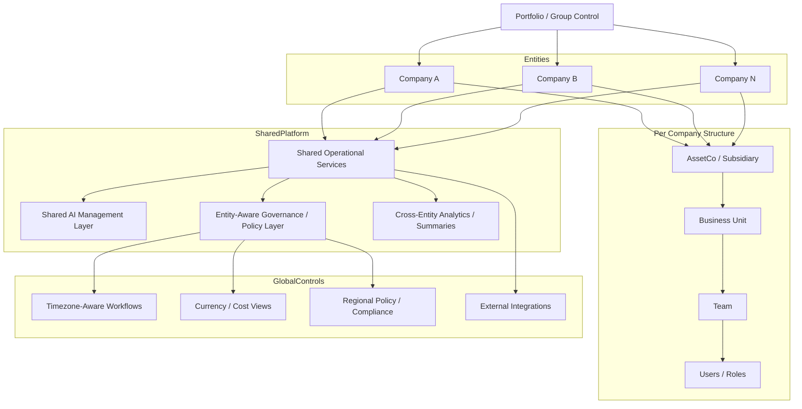
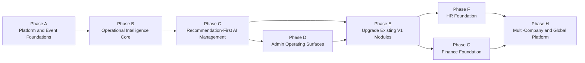
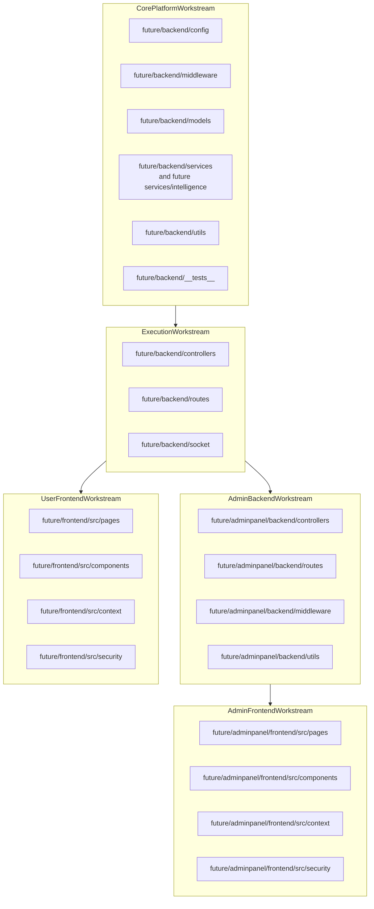

# FundCo AI V2 Diagram Pack

Generated: April 28, 2026

This pack is intended to make V2 development faster and less ambiguous. The diagrams are written in Mermaid so they can be rendered in GitHub, VS Code Markdown preview with Mermaid support, and other Mermaid-capable tools.

These diagrams are not decorative. They are implementation maps. A senior developer should be able to use them together with the V2 planning documents to understand:

- the target system shape
- the runtime boundaries
- the domain breakdown
- the event architecture
- the AI management loop
- the admin operating surfaces
- the HR and Finance expansion path
- the multi-company global model
- the phase dependencies
- the module ownership model for the `future` directory

---

## 1. V2 System Context

---

## 2. V2 Container Architecture

---

## 3. V2 Domain Map

---

## 4. Operational Event Flow

---

## 5. AI Management Decision Loop

---

## 6. V2 Admin UX Map

---

## 7. HR and Finance Integration Model

---

## 8. Multi-Company Global Platform Model

---

## 9. Phase Dependency Map

---

## 10. Future Directory Module Ownership Map

---

## 11. How to use this pack during implementation

- Use Diagram 1 and Diagram 2 when making architectural decisions.
- Use Diagram 3 and Diagram 4 before touching domain services or the event layer.
- Use Diagram 5 when implementing AI actions and governance.
- Use Diagram 6 while designing the V2 admin application.
- Use Diagram 7 before starting HR and Finance.
- Use Diagram 8 before adding multi-company support.
- Use Diagram 9 to enforce phase order and avoid building on unstable foundations.
- Use Diagram 10 when assigning module ownership and implementation responsibility.

## 12. Recommended next diagram set after coding begins

Once implementation starts, add a second diagram pack for:

- database entity relationship diagrams for new intelligence models
- sequence diagrams for task assignment, escalation, and management inbox actions
- API contract diagrams for admin surfaces
- queue and worker lifecycle diagrams
- deployment topology diagrams for staging and production
